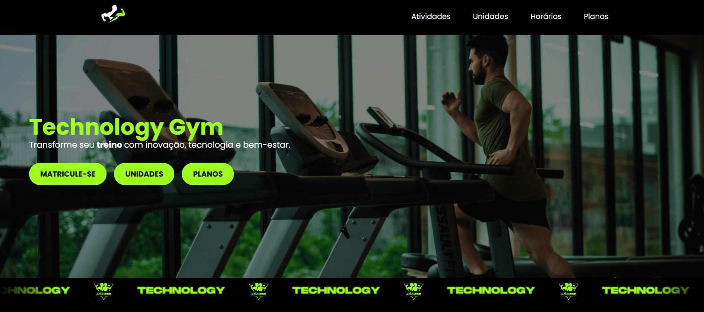
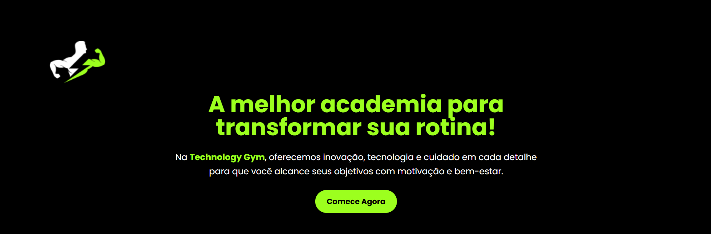

<!-- # Technology Gym

> Template de site para academias, construído com React, TypeScript e Tailwind CSS.

Este projeto é um template moderno para academias, com foco em performance, escalabilidade e facilidade de customização. Originalmente desenvolvido com Styled Components, está sendo refatorado para **Tailwind CSS**, mantendo TypeScript para maior segurança e manutenibilidade.

## Tecnologias Utilizadas

- **React** – Biblioteca JavaScript para construção de interfaces.
- **TypeScript** – Tipagem estática para maior segurança do código.
- **Tailwind CSS** – Framework utilitário para estilização rápida e responsiva.
- **Vite** – Bundler moderno para desenvolvimento rápido.

## Funcionalidades

- Layout responsivo para desktop e mobile.
- Seções típicas de sites de academias: home, atividades, unidades, horários e planos.
- Componentes reutilizáveis em TypeScript + Tailwind.
- Fácil de customizar e expandir conforme necessidades do projeto. -->

# Technology Gym

Template moderno de site para academias, desenvolvido com foco em experiência do usuário, performance e arquitetura escalável, utilizando **React**, **TypeScript**, **Tailwind CSS** e **Vite**.

O projeto inclui componentes reutilizáveis, formulário com validação robusta e estrutura preparada para expansão futura, seguindo boas práticas de desenvolvimento front-end.

---

## Tecnologias Utilizadas

- **React**: Construção de interfaces modernas e componentizadas
- **TypeScript**: Tipagem estática e maior segurança no código
- **Tailwind CSS**: Estilização utilitária e responsiva
- **Vite**: Build tool rápida e eficiente
- **React Hook Form**: Gerenciamento performático de formulários
- **Zod**: Validação de dados com schema tipado

---

## Funcionalidades

- Layout responsivo (desktop, tablet e mobile)
- Seções institucionais para academias:
  - Home
  - Atividades
  - Planos
  - Unidades
  - Horários

- Formulário de matrícula com:
  - Validação de campos
  - Máscaras de entrada
  - Feedback de erros em tempo real

- Componentes reutilizáveis e escaláveis
- Estrutura organizada para fácil manutenção

---

## Preview do Projeto




---

## Objetivo do Projeto

- componentização reutilizável
- validação robusta de formulários
- organização escalável
- experiência de usuário moderna
- código limpo e tipado

---

## Execução do Projeto

### Pré-requisitos

Antes de iniciar, você precisa ter instalado:

- Node.js (versão LTS recomendada)
- npm ou yarn
- Git

---

### Passo a passo

Clone o repositório:

```
git clone https://github.com/anamartinsr/technology_gym.git
```

Acesse a pasta do projeto:

```
cd technology_gym
```

Instale as dependências:

```
npm install
```

Execute o projeto em ambiente de desenvolvimento:

```
npm run dev
```

---

## Acesso à Aplicação

Após iniciar, o projeto estará disponível em:

```
http://localhost:5173
```

---

## Build para Produção

Para gerar a versão otimizada:

```
npm run build
```

Preview da build:

```
npm run preview
```

---

## Boas Práticas Aplicadas

- Componentes desacoplados
- Tipagem forte com TypeScript
- Validação centralizada com Zod
- Separação de dados e UI
- Responsividade mobile-first

---

## Contribuições

Contribuições são bem-vindas.

Sinta-se à vontade para abrir issues, enviar pull requests ou sugerir melhorias.

---

## Forks e Uso do Projeto

Você pode forkar, estudar, adaptar e evoluir este projeto livremente.
